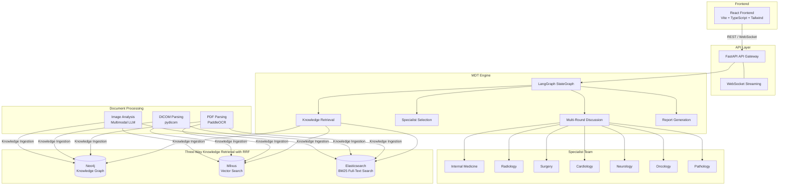
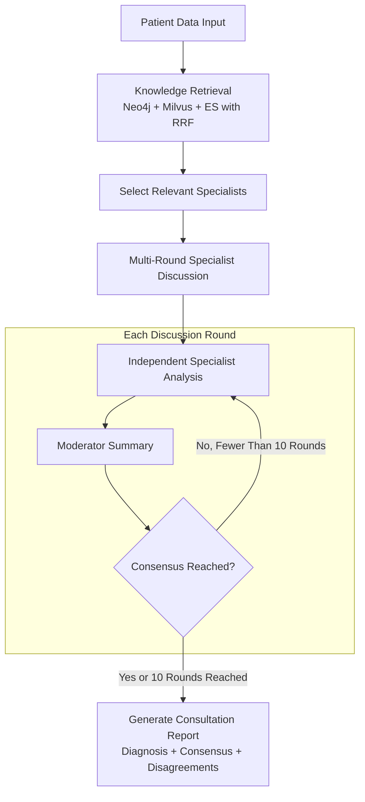

# MedMDT

A multi-expert medical consultation (MDT) agent system that uses LLM-powered multidisciplinary collaboration to support clinical diagnosis and decision-making.

## System Architecture



## Key Features

- **Multi-expert consultation**: Seven AI specialists (internal medicine, radiology, surgery, cardiology, neurology, oncology, and pathology) hold multi-round discussions that mirror a real MDT workflow
- **Multi-model collaboration**: Configure a different LLM for each specialist (OpenAI, Anthropic, DeepSeek, Ollama, and others) to take advantage of each model's strengths
- **Three-way knowledge retrieval**: Fuse Neo4j knowledge-graph search, Milvus vector search, and Elasticsearch BM25 with RRF for precise medical knowledge retrieval
- **Real-time streaming updates**: WebSocket events stream consultation progress and display the discussion live in the frontend
- **Multi-format document processing**: Extract and ingest knowledge from PDFs (PaddleOCR), DICOM medical images, and standard image formats
- **Consensus and disagreement analysis**: Automatically identify areas of agreement and disagreement and generate a structured consultation report

## Technology Stack

| Layer | Technology |
|------|------|
| Frontend | React 18 + TypeScript + Vite + Tailwind CSS |
| API | FastAPI + WebSocket |
| Orchestration | LangGraph StateGraph |
| LLM | LangChain (OpenAI / Anthropic / DeepSeek / Ollama) |
| Knowledge Graph | Neo4j |
| Vector Search | Milvus |
| Full-Text Search | Elasticsearch |
| Document Parsing | PaddleOCR + pydicom + Pillow |

## Project Structure

```
MedMDT/
├── backend/                  # Python backend
│   ├── src/medmdt/
│   │   ├── api/              # FastAPI routes, WebSocket, and dependency injection
│   │   ├── config/           # Pydantic Settings configuration
│   │   ├── extractor/        # Document parsing (PDF/DICOM/Image)
│   │   ├── knowledge/        # Knowledge storage and retrieval (Neo4j/Milvus/ES)
│   │   ├── llm/              # LLM providers and prompt templates
│   │   └── mdt/              # MDT engine (specialists/moderator/multi-round discussion/state graph)
│   ├── config/experts.yaml   # Specialist configuration (roles, models, and prompts)
│   ├── scripts/              # CLI entry points (server.py / ingest.py)
│   ├── tests/                # Unit tests (29 test files)
│   └── pyproject.toml
├── frontend/                 # React frontend
│   ├── src/
│   │   ├── components/       # UI components (consultation/knowledge/layout)
│   │   ├── hooks/            # WebSocket streaming and polling hooks
│   │   ├── lib/              # API client and type definitions
│   │   └── pages/            # Pages (dashboard/consultation/knowledge base/history)
│   └── package.json
└── README.md
```

## Quick Start

### Prerequisites

- Python 3.12+ & [uv](https://docs.astral.sh/uv/)
- Node.js 18+
- Docker (for Neo4j, Milvus, and Elasticsearch)

### Option 1: First-time Setup

```bash
# 1. Configure environment variables
cd backend && cp .env.example .env
# Edit .env and add the LLM API key and other settings

# 2. Install dependencies and start all services
cd .. && make setup
```

`make setup` installs the backend Python dependencies, installs the frontend npm packages, starts the Docker infrastructure, launches the backend API, and then starts the frontend development server.

### Option 2: Daily Startup

```bash
make start
```

### Other Commands

```bash
make stop    # Stop all services (frontend, backend, and Docker)
make clean   # Remove dependencies and Docker volumes
```

### Service URLs

| Service | URL |
|------|------|
| Frontend | http://localhost:5173 |
| Backend API | http://localhost:8000 |
| API Documentation | http://localhost:8000/docs |
| Neo4j Browser | http://localhost:7474 |

## API Overview

| Method | Path | Description |
|------|------|------|
| POST | `/api/v1/consultation` | Create a consultation |
| GET | `/api/v1/consultation` | List consultations |
| GET | `/api/v1/consultation/{id}` | Get consultation details |
| WS | `/api/v1/consultation/{id}/stream` | Stream real-time progress |
| POST | `/api/v1/knowledge/search` | Search the knowledge base |
| POST | `/api/v1/knowledge/ingest` | Upload and ingest a file |
| GET | `/api/v1/knowledge/ingest/{job_id}` | Get ingestion job status |

## Consultation Workflow



## License

MIT
